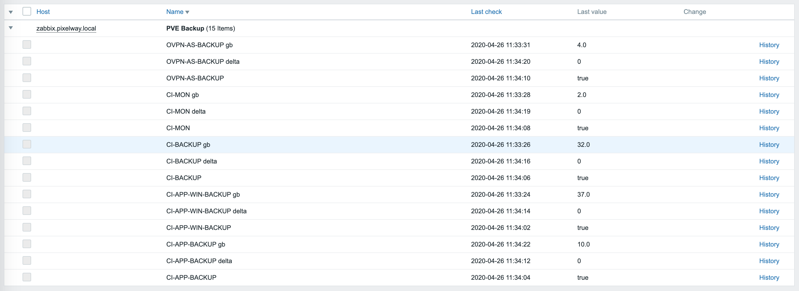
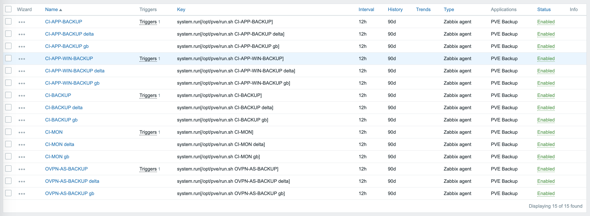
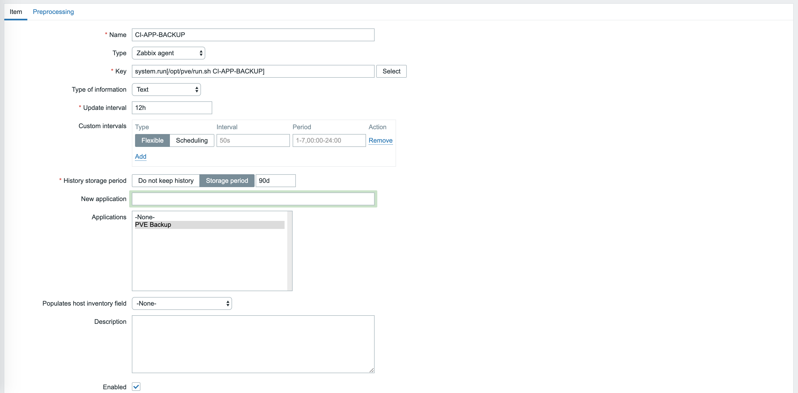
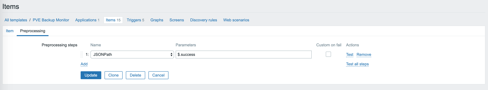
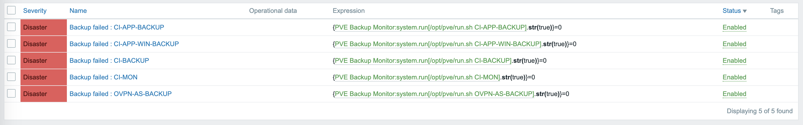
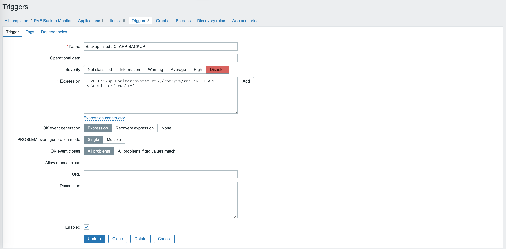

# pve-backup-monitor
Proxmox Backup Monitoring script for Zabbix

## Installation of the script.

Open ssh on target server and type :

<pre>
    sudo -i
    chmod a+rw /opt
    cd /opt
    git clone ...
    mv pve-backup-monitor pve
    cd pve
    pip install -r requirements.txt
    chmod +x run.sh
</pre>

Upgrade main.py values :

<pre>
HOST = 'https://set_proxmox_host_here:8006'
USERNAME = 'set username here !!!!'
PASSWORD = 'set password here !!!!'
</pre>

## Zabbix agent configuration

Add EnableRemoteCommands=1 option

## Zabbix configuration

1. Create new template
2. Create new application
3. Add new item, for example:
 
 
    Name : CI-APP-BACKUP 
    Type : Zabbix Agent 
    Key : system.run[/opt/pve/run.sh CI-APP-BACKUP] 
    Applications: select created application 

4. Add new trigger to call the item

Monitoring:

Items:

Item edit:

Item edit preprocessing:

Triggers:

Trigger edit:
